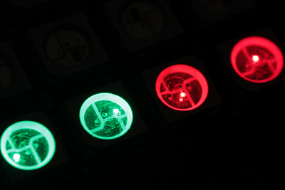
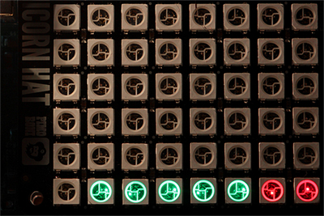

# GoCD/cctray.xml Raspberry Pi + Unicorn HAT Monitor

show [GoCD](https://www.go.cd/)/cctray.xml status on a Raspberry Pi + a Unicorn HAT (HD)

[](https://travis-ci.org/d-led/cctray-rpi-unicorn-hat-monitor)



## Prerequisites

- Raspberry Pi, i.e. [3](https://www.raspberrypi.org/products/raspberry-pi-3-model-b/)
- [Raspbian](https://www.raspberrypi.org/downloads/raspbian/)
- [Unicorn HAT](https://shop.pimoroni.de/products/unicorn-hat) or [Unicorn HAT HD](https://shop.pimoroni.com/products/unicorn-hat-hd)
- follow HAT installation instructions at [https://github.com/pimoroni/unicorn-hat](https://github.com/pimoroni/unicorn-hat) or [https://github.com/pimoroni/unicorn-hat-hd](https://github.com/pimoroni/unicorn-hat-hd)
- clone this project
- A `cctray.xml` url. Any [cctray.xml providing tool (see 
ccmenu wiki)](https://github.com/erikdoe/ccmenu/wiki/Supported-Servers) are expected to work as well. E.g. my [Travis-CI](https://docs.travis-ci.com/user/cc-menu/) status: [xml](https://api.travis-ci.org/repos/d-led.xml)


## Unicorn HAT Usage

```
sudo python poll.py <cctray.xml_url> <poll_wait_s>
```

- the cctray.xml URL can include basic authentication
- if the number of status entries exceeds the number of LEDs on the LED matrix (64, here), only the top level entries will be used.
- after the number of top level exceeds the number of LEDs, the input will be trimmed



## Unicorn HAT HD Usage

```
sudo python poll_hd.py <poll_wait_s> <cctray.xml_url_1> <cctray.xml_url_2> .. <cctray.xml_url_n>
```

- same visualization logic as with for the HAT


## If you don't use GoCD / can't access cctray.xml

> currently, not for the HD HAT. Contribute if necessary

Use a small HTTP server (based on [Flask](http://flask.pocoo.org)) listening to incoming arrays of status:

```python
sudo python server.py
```

push status i.e. with [httpie](https://httpie.org):

```
http post http://127.0.0.1:5500/update status:='["NONE","BUILDING","OK","ERROR","NONE","WHAT?"]' --auth ...
```

or write your own polling script taking [poll.py](poll.py) as an example.


Valid status strings: `NONE, BUILDING, ERROR, OK, UNKNOWN`

## Running as a systemd Service

- customize [install_as_service.sh](install_as_service.sh)
- `sudo ./install_as_service.sh`
- reboot or `sudo systemctl start cctray_poller.service`
- to uninstall: `sudo ./uninstall_service.sh`
- current limitation: the LEDs won't be turned off on signal (service stop): #1

## GoCD pipeline as code

The project can be built on GoCD using the new feature: [pipeline configuration from source control #1133](https://github.com/gocd/gocd/issues/1133). For this, use:

- the gocd [yaml config plugin](https://github.com/tomzo/gocd-yaml-config-plugin/releases)
- this repository as primary material and as the pipeline definition

The pipeline configuration can be seen in [ci.gocd.yaml](ci.gocd.yaml)

The GoCD XML config needs the following addition:

```xml
  <config-repos>
    <config-repo plugin="yaml.config.plugin">
      <git url="https://github.com/d-led/gocd-rpi-unicorn-hat-monitor.git" />
    </config-repo>
  </config-repos>
```
